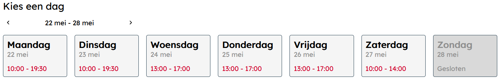
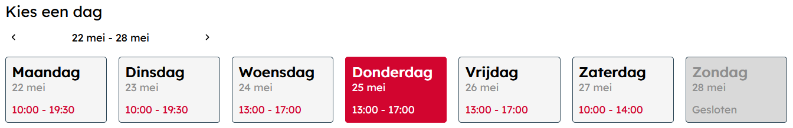
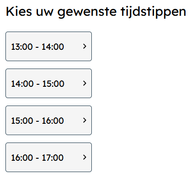
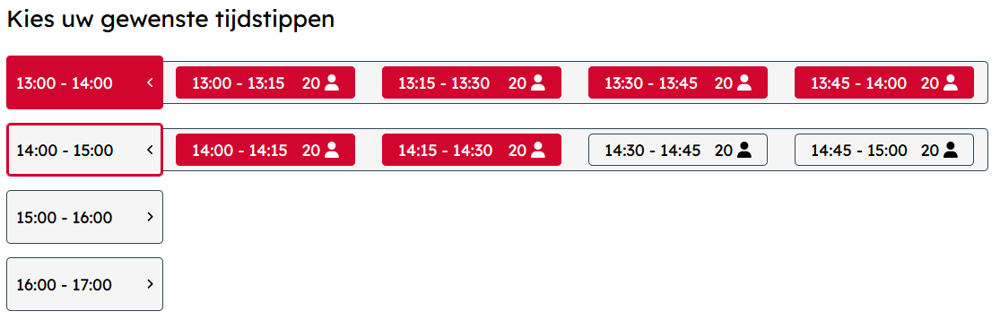
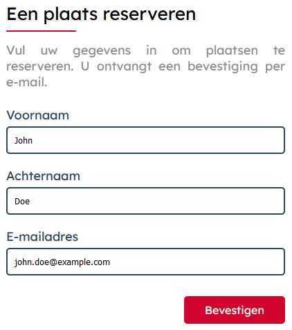
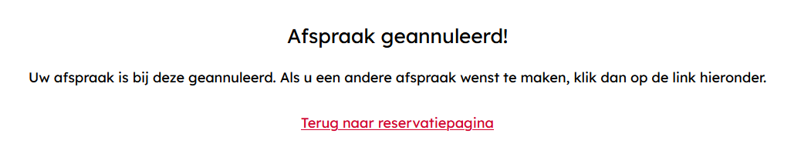
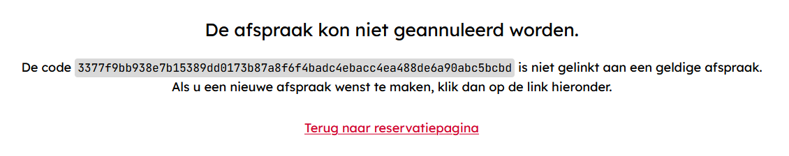

# User Manual

In this manual, we'll quickly brush over how to place a reservation using our application. 
Everything should be straight forward, but feel free to reference this guide when you get stuck.

## Selecting a Day

To start, select one of the days shown at the top of the screen. Days that are greyed out, like Sunday in this example, 
are not available, and thus can not be clicked on.

When a day is selected, it will be highlighted in red, and timeslots will show up below it. 

> Note: Only one day can be selected at a time.

If you wish to make a reservation for a day in a future week, 
you can use the arrow buttons shown above the days to navigate between weeks.

## Selecting Timeslots

Timeslots come grouped in sets of one hour, as seen below. 

When one of these groups is clicked, all timeslots it contains will be added to your reservation.
Alternatively, the button on the right side of the group can be pressed in order to reveal the individual timeslots. 
These timeslots, each 15 minutes long, can then be selected individually.

## Filling in the Form

After selecting timeslots, all that's left to do is fill in your personal information in the form on the right.
All we need to know is your first- and last name, as well as an email address to contact you.
The confirmation button will only become available when all of this information is provided.

After confirming your reservation, an email will be sent to the provided address. 
This email contains a link, which you will need in case you wish to cancel your reservation later.

## Cancelling a Reservation

To cancel your reservation, simply click the link you received alongside your confirmation email. 
It will lead you to a page containing the following message.

If, instead, you see the message below, this is an indication that the reservation is likely already cancelled.
Make sure you clicked the link from the correct email.

